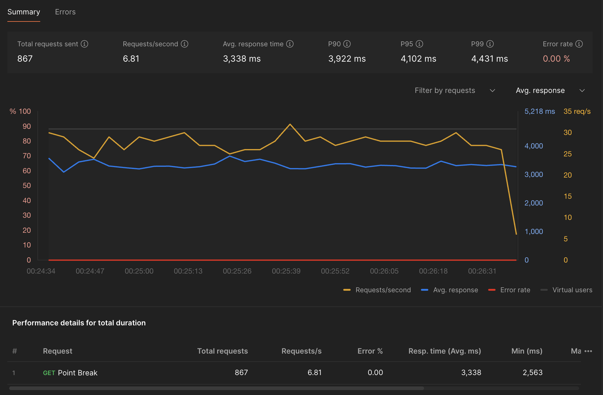

[](https://www.python.org/) [](https://fastapi.tiangolo.com/) [](https://playwright.dev/) [](https://www.docker.com/)

# Operation Point Break

American Airlines hides the side-by-side comparison that would show whether cash or award bookings are the better deal. This project automates those checks and exposes the results through a simple FastAPI service.

## Assumptions
- The challenge provides a single departure date, so searches are performed as **One-Way** itineraries.
- Only the `MAIN` and `PREMIUM_ECONOMY` cross-reference buckets can be reliably compared across cash and award responses today.
- Award and cash data are matched via the `hash` identifier returned by AA's internal API; if either side omits a hash the flight is ignored.
- The scraper currently targets adult passengers and expects airport codes in IATA format.

## Technologies Used
- Python 3.12
- Playwright (headless Firefox)
- FastAPI & Uvicorn
- uv (dependency and runtime manager)
- Docker (deployment packaging)

## Project Structure
```
.
├── app/
│   ├── api/              # FastAPI routers
│   ├── core/             # Shared constants and configuration
│   ├── models/           # Pydantic response schemas
│   └── services/         # Scraper + aggregation logic
├── main.py               # CLI entrypoint delegating to app.main
├── Dockerfile            # Container image definition
├── pyproject.toml        # Project metadata
└── uv.lock               # Locked dependency graph
```

## Approach and Implementation
Operation Point Break runs a FastAPI boundary layer that routes requests into three cooperating services: `browser_manager` (Playwright lifecycle and concurrency), `aa_client` (session-bound AA fetch wrapper), and `flight_service` (pricing merge + CPP math). The API layer injects these services per request so the business logic stays testable and the Pydantic response schemas remain the single source of truth for payload structure.

Within the browser tier, the manager stands up dual browser engines (WebKit + Firefox) to rotate fingerprints to evade AA's browser-level bot detection, hydrates them through the AA booking flow, and uses a shared-page concurrency model so every incoming search can reuse a warm page rather than cold-starting a new context. A cooperative async dispatcher tracks request counts per page (rotating after 75), watches for Playwright crash signals, and brings replacement contexts online without dropping in-flight traffic. Session cookies and local storage are preserved across swaps to maintain bot-evasion parity.

Back-office work happens in the flight service: award and cash itineraries are fetched through the browser context, normalized to internal dataclasses, intersected on AA's `hash` identifier, and filtered down to cabins that expose complete pricing.

Putting that architecture in motion looks like this:

1. A Playwright session loads AA's booking page headlessly, then executes the itinerary `fetch` from inside the browser with `credentials: include` so AA recognizes it as a live customer session.
2. Two POSTs are issued per search: one for award pricing (`searchType="Award"`) and one for cash pricing (`searchType="Revenue"`).
3. Flights are intersected via the shared `hash` field. Each surviving flight pulls departure/arrival timestamps, the relevant cabin product groups, and the per-passenger prices.
4. CPP is computed as `(cash_price_usd - taxes_fees_usd) / points_required * 100`, rounded to two decimals. Responses that lack the needed pricing blocks are skipped.
5. FastAPI exposes `/flights` for the comparison and `/health` for readiness checks. Errors from AA's API propagate as `502` responses, while validation issues (e.g., unsupported cabin class) surface as `400`s.
6. Connectivity is validated against multiple Surfshark exit nodes (Argentina, US, EU) to ensure the flows survive geo shifts; residential-style Surfshark IPs stay reliable, while data-center ranges get consistently blocked by AA.

**Latest achievements:**
- Sustained 100+ sequential AA searches without rotating browser fingerprints or cooling down the Playwright session.
- Completed a 2-minute load test at 6.81 requests/second (867 total) with 0.00% error rate and a 3,338 ms average response while maintaining bot-evasion parity.



## Running Locally
1. Install dependencies and browsers:
   ```bash
   uv sync
   uv run playwright install firefox
   ```
2. Start the API server:
   ```bash
   uv run uvicorn app.main:app --host 0.0.0.0 --port 8000
   ```
3. Call the comparison endpoint:
   ```bash
   curl "http://localhost:8000/flights?origin=LAX&destination=JFK&date=2025-12-15&passengers=1&cabin_class=main"
   ```

## Running with Docker
```bash
docker build -t point-break .
docker run --rm -p 8000:8000 point-break
```

Alternatively, run the published image directly:
```bash
docker run --rm -p 8000:8000 maxilr/point-break:latest
```

Note: containerized runs may have constrained CPU, memory, or network resources, so observed performance might differ from bare-metal expectations.

## API Endpoints
- `GET /health` → `{ "status": "ok" }`
- `GET /flights` → accepts `origin`, `destination`, `date`, `passengers`, `cabin_class` as query string parameters and returns the pricing comparison payload.

## Example output.json
```json
{
  "search_metadata": {
    "origin": "LAX",
    "destination": "JFK",
    "date": "2025-12-15",
    "passengers": 1,
    "cabin_class": "main"
  },
  "flights": [
    {
      "flight_number": "AA123",
      "departure_time": "08:00",
      "arrival_time": "16:30",
      "points_required": 12500,
      "cash_price_usd": 289.0,
      "taxes_fees_usd": 5.6,
      "cpp": 2.27
    },
    {
      "flight_number": "AA456",
      "departure_time": "14:15",
      "arrival_time": "22:45",
      "points_required": 10000,
      "cash_price_usd": 189.0,
      "taxes_fees_usd": 5.6,
      "cpp": 1.83
    }
  ],
  "total_results": 2
}
```

> The example illustrates the required response shape; live numbers depend on real-time AA availability.

## Additional Notes
- The bot evasion strategy relies on Playwright maintaining real browser fingerprints and cookies. For higher resilience you can rotate user agents, add random delays, or proxy requests, though AA's current flows already accept this approach.
- Extend the `AVAILABLE_CROSS_REFERENCES` list to support more cabins once AA exposes consistent identifiers for them across award and cash searches.

## Explanation
Further enhancement for perpetual functioning can be achieved by implementing a proxy rotation strategy on top of browser fingerprinting rotation to reduce proxy usage. To withstand bigger concurrent loads horizontal scalability of this service is suggested with an L4 Load Balancer.
